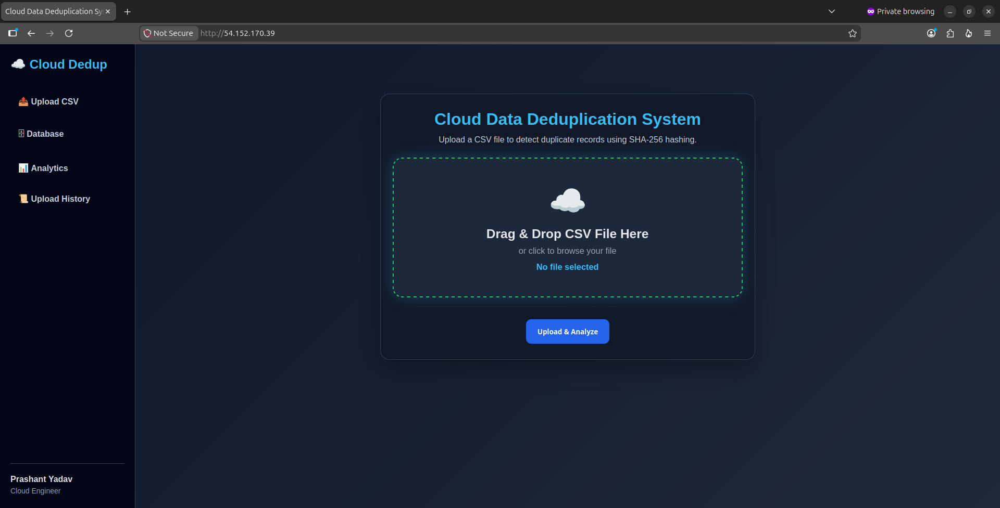
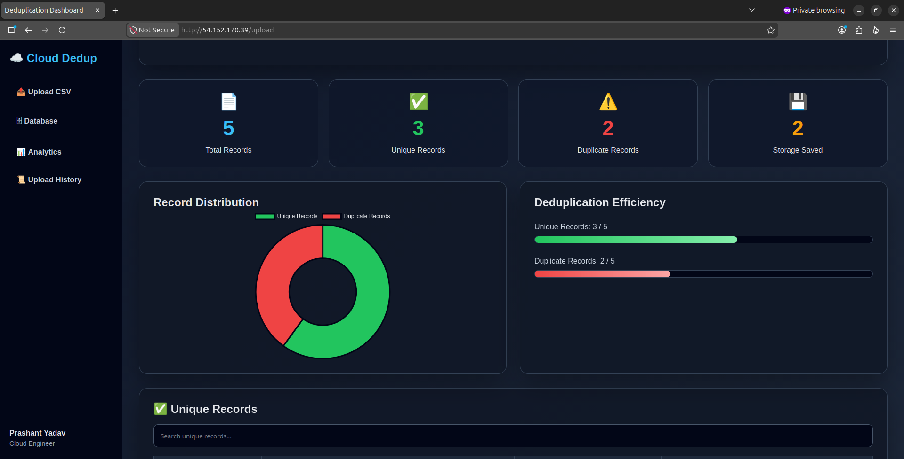
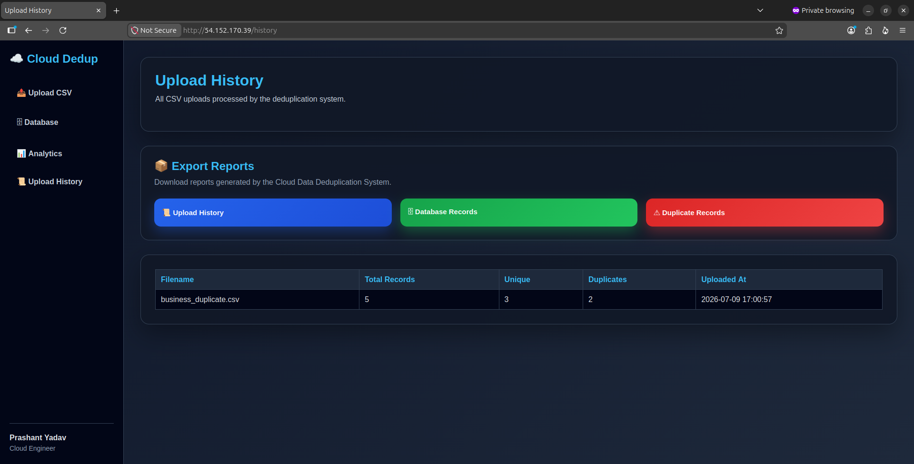
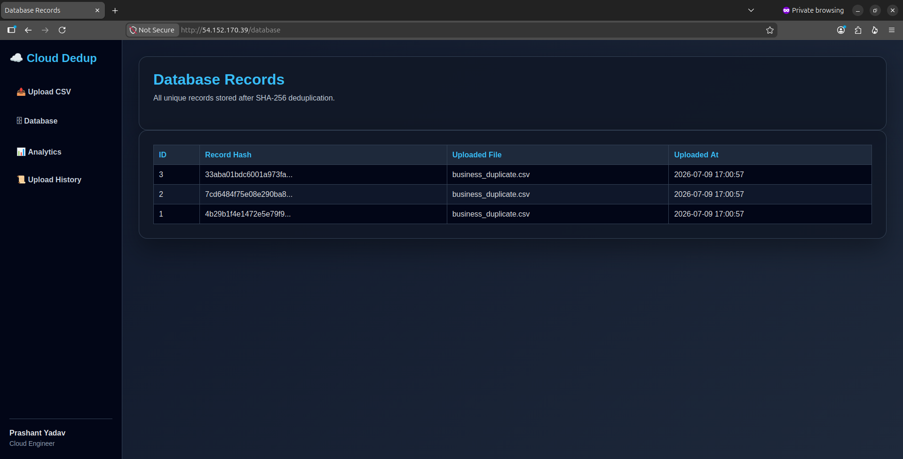
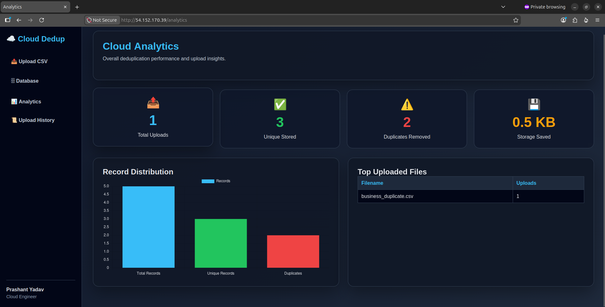
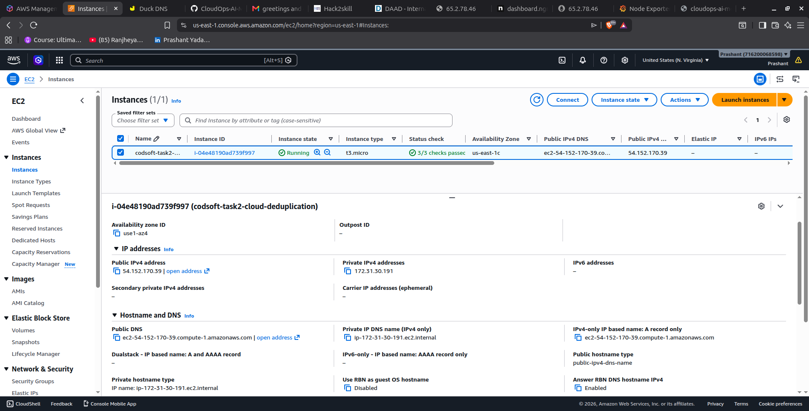

# ☁️ Cloud Data Deduplication System using AWS

A cloud-based application that detects and eliminates duplicate data records before storing them in the database. The application compares uploaded CSV records with existing data using **SHA-256 hashing**, ensuring only verified unique records are stored. It is deployed on **AWS EC2** using **Gunicorn** and **Nginx**.

---

# 🚀 Live Demo

**Live Application**

http://54.152.170.39

---

# 📌 Features

- Upload CSV files
- Drag & Drop file upload
- SHA-256 based duplicate detection
- Smart deduplication (ignores ID columns)
- Stores only unique records
- SQLite persistent database
- Upload history
- Database explorer
- Analytics dashboard
- Record distribution charts
- CSV export reports
- Responsive dashboard
- Cloud deployment on AWS EC2
- Gunicorn production server
- Nginx reverse proxy

---

# 🛠 Tech Stack

### Backend

- Python
- Flask
- Pandas
- SQLite

### Frontend

- HTML5
- CSS3
- JavaScript
- Chart.js

### Cloud

- AWS EC2
- Gunicorn
- Nginx

### Version Control

- Git
- GitHub

---

# 📂 Project Structure

```text
CODSOFT_TASK2_Cloud_Data_Deduplication_System/

├── app.py
├── requirements.txt
├── README.md
│
├── database/
│   └── deduplication.db
│
├── screenshots/
│   ├── 01-home.png
│   ├── 02-result-dashboard.png
│   ├── 03-upload-history.png
│   ├── 04-database-records.png
│   ├── 05-analytics.png
│   └── 06-aws-ec2-running.png
│
├── static/
│   └── style.css
│
├── templates/
│   ├── index.html
│   ├── result.html
│   ├── history.html
│   ├── database.html
│   ├── analytics.html
│   └── sidebar.html
│
└── uploads/
```

---

# ⚙️ How It Works

1. Upload a CSV file.
2. The application reads each record.
3. SHA-256 hash is generated for every record.
4. Existing hashes in SQLite are checked.
5. Duplicate records are rejected.
6. Unique records are stored.
7. Dashboard displays statistics and analytics.

---

# 📊 Dashboard Features

- Total Records
- Unique Records
- Duplicate Records
- Storage Saved
- Upload History
- Database Explorer
- Analytics Dashboard
- CSV Export

---

# ☁️ AWS Deployment

The application is deployed on:

- AWS EC2 Ubuntu
- Gunicorn WSGI Server
- Nginx Reverse Proxy

Deployment Flow

```
Internet
      │
      ▼
 Nginx (Port 80)
      │
      ▼
 Gunicorn
      │
      ▼
 Flask Application
      │
      ▼
 SQLite Database
```

---

# 📷 Project Screenshots

## Home Page



---

## Result Dashboard



---

## Upload History



---

## Database Explorer



---

## Analytics Dashboard



---

## AWS EC2 Deployment



---

# 🎯 Future Improvements

- Amazon RDS integration
- Amazon S3 storage
- User Authentication
- REST API
- File Encryption
- Docker Support
- CI/CD Pipeline
- Kubernetes Deployment

---

# 👨‍💻 Author

**Prashant Yadav**

GitHub:

https://github.com/Prashant12588

---

# ⭐ Project Status

✅ Completed

Developed as part of the **CodSoft Cloud Computing Internship**.
